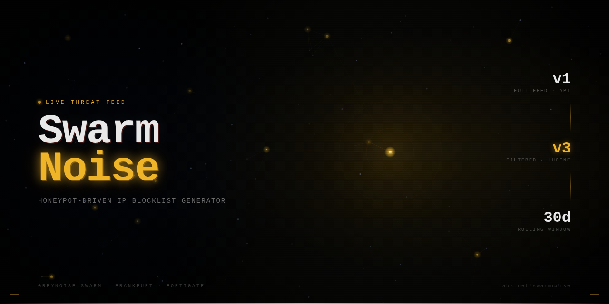

# swarmnoise

<p align="center">
  
</p>

[](#)
[](#)
[](#)
[](#)

Automated collector for GreyNoise Project Swarm sensor activity. Deploys one or more Swarm sensors and produces newline-separated IP threat feeds compatible with any firewall or security platform that supports external IP block lists — including FortiGate, pfSense/OPNsense, Palo Alto Networks (EDL), and others. Monthly snapshots are archived for long-term evidence retention.

---

## Data & Licensing

- **You must provide your own GreyNoise account.** This project uses the GreyNoise API. All use of GreyNoise data is subject to the [GreyNoise EULA](https://www.greynoise.io/terms).
- **No live or real threat data is included in this repository.** Files under `feeds/`, `runs/`, and `state/` contain synthetic example data only. Deploy your own instance and configure your secrets to collect real data.
- GreyNoise is a trademark of GreyNoise Intelligence, Inc. Fortinet, FortiGate, Palo Alto Networks, pfSense, and OPNsense are trademarks of their respective owners. All trademarks are used for identification purposes only.

---

## At a glance

- Scope: attacker source IPs seen by your Swarm sensor(s)
- Output: full feed + filtered feed + enriched metadata + run logs + monthly archive
- Runtime: GitHub Actions only (no self-hosted infrastructure)
- Update model: randomized 1 to 10 fetches/day via hourly scheduler checks
- Integration: direct HTTPS feed consumption by any firewall supporting external IP block lists

## Table of contents

- [Threat feeds](#threat-feeds)
- [Firewall integration](#firewall-integration)
- [Collection architecture](#collection-architecture)
- [Scheduler behavior](#scheduler-behavior)
- [Monthly archive snapshots](#monthly-archive-snapshots)
- [Repository structure](#repository-structure)
- [Setup](#setup)
- [File schemas](#file-schemas)
- [Querying data locally](#querying-data-locally)
- [Operator playbook](#operator-playbook)
- [Troubleshooting](#troubleshooting)
- [Security notes](#security-notes)

---

## Threat feeds

### Full feed

```text
https://raw.githubusercontent.com/<your-org>/<your-repo>/main/feeds/threat_feed.txt
```

All source IPs observed attacking the sensor in the last 30 days.

- Highest coverage
- Higher false-positive risk than the filtered feed

### Filtered feed

```text
https://raw.githubusercontent.com/<your-org>/<your-repo>/main/feeds/threat_feed_filtered.txt
```

Subset of the full feed where session classification matches:

- `classification:malicious`
- `classification:suspicious`

The filtered stream is built from the [GreyNoise v3 Sessions API](https://docs.greynoise.io/reference/getsessions) and includes enriched metadata in `feeds/filtered_metadata.json` (tags, CVEs, geo, ASN/org, Suricata signatures, protocols, destination ports).

Both feeds are:

- One IP per line (no comments, no headers)
- Rolling 30-day window (auto-pruned)
- Updated at randomized times each day

---

## Firewall integration

Both feed files are plain newline-separated IP lists with no headers or comments, making them compatible with any platform that supports external IP block lists or threat feed connectors.

### Generic configuration

| Field | Value |
|---|---|
| Feed URL (full) | `https://raw.githubusercontent.com/<your-org>/<your-repo>/main/feeds/threat_feed.txt` |
| Feed URL (filtered) | `https://raw.githubusercontent.com/<your-org>/<your-repo>/main/feeds/threat_feed_filtered.txt` |
| Format | One IP per line, no headers |
| Authentication | None (public repo) or token-based (private repo) |
| Recommended refresh | 60 min |

### Platform examples

**FortiGate** — `Security Fabric → External Connectors → Threat Feeds → IP Address`

| Field | Value |
|---|---|
| Name | `swarmnoise` |
| URI | feed URL from above |
| HTTP basic auth | off |
| Refresh rate | 60 min |

**Palo Alto Networks (EDL)** — `Objects → External Dynamic Lists`

| Field | Value |
|---|---|
| Type | IP List |
| Source | feed URL from above |
| Repeat | Every hour |

**pfSense / OPNsense** — `Firewall → Aliases → URLs`

| Field | Value |
|---|---|
| Type | URL Table (IPs) |
| URL | feed URL from above |
| Refresh | 1 day (or use cron for hourly) |

For lower false-positive tolerance, use `threat_feed_filtered.txt` as the feed URL on any platform.

---

## Collection architecture

The collector uses two GreyNoise API paths in parallel:

| | Full feed | Filtered feed |
|---|---|---|
| API | v1 Swarm (`/v1/workspaces/{id}/sensors/activity`) | v3 Sessions (`/v3/sessions`) |
| Filter | none | `classification:malicious OR classification:suspicious` |
| Page size | 1000 | 100 |
| Pagination | 30-minute chunk windows | page-based |
| Metadata depth | basic | enriched (tags, CVEs, geo, signatures) |

### First run bootstrap

If `feeds/ip_metadata.json` does not exist, bootstrap mode fetches the last 30 days automatically.

### Pagination constraints

The v1 scroll token is too large to reuse safely in request paths/headers, so v1 collection runs in 30-minute time chunks. This keeps feed convergence high and operationally stable under API limits.

---

## Scheduler behavior

Workflow: `.github/workflows/scheduler.yml`

- Hourly cron trigger (`0 * * * *`)
- Daily random plan generated in Berlin time (`Europe/Berlin`)
- Randomized target: 1 to 10 runs/day
- Scheduled hours persisted in `state/today.json`
- Missed-hour catch-up logic included (overdue hour handling)
- On failure, automatic retry at next cron tick
- `workflow_dispatch` bypasses schedule gating and forces a fetch

Result: organic, hard-to-predict update timing rather than rigid fixed intervals.

---

## Monthly archive snapshots

Workflow: `.github/workflows/monthly_archive.yml`

- Triggered daily at `23:00 UTC`
- Executes only on the last day of month (manual dispatch can bypass guard)
- Runs `scripts/archive_month.py`
- Writes `archive/YYYY-MM/` with:
  - `filtered_metadata.json`
  - `ip_metadata.json`
  - `summary.json`

This provides durable month-end snapshots independent of the rolling 30-day live window.

---

## Repository structure

```text
swarmnoise/
  .github/workflows/
    scheduler.yml
    monthly_archive.yml
  scripts/
    fetch_sessions.py
    archive_month.py
  feeds/
    threat_feed.txt
    threat_feed_filtered.txt
    ip_metadata.json
    filtered_metadata.json
  runs/
  state/
    today.json
  archive/
    YYYY-MM/
      filtered_metadata.json
      ip_metadata.json
      summary.json
  requirements.txt
  README.md
```

---

## Setup

### 1. Fork or clone this repository

Fork `swarmnoise` into your own GitHub account or organization.

### 2. Set GitHub Actions secrets

Go to `Settings → Secrets and variables → Actions` in your fork and add:

| Secret | Description |
|---|---|
| `GREYNOISE_API_KEY` | GreyNoise API key (from `viz.greynoise.io` → Settings → API) |
| `WORKSPACE_ID` | GreyNoise workspace UUID |
| `SENSOR_ID` | Swarm sensor UUID |
| `GH_PAT` | GitHub Personal Access Token with `repo` scope (used by workflows to commit feed updates) |

### 3. Enable GitHub Actions

Actions are enabled by default on forks. Verify both workflows are active under `Actions → Workflows`.

### 4. Trigger a first run

Use `workflow_dispatch` on the `Scheduler — Randomized Daily Fetch` workflow to force an immediate bootstrap fetch. The first run will collect the last 30 days of sensor data automatically.

### 5. Point your firewall at the feed URLs

Replace `<your-org>/<your-repo>` in the feed URLs with your fork's path. If the repo is private, configure token-based access on your firewall platform.

---

## File schemas

`feeds/ip_metadata.json` (rolling 30-day index)

```json
{
  "192.0.2.1": {
    "first_seen": "2026-04-05T09:00:00Z",
    "last_seen": "2026-05-05T10:26:00Z"
  }
}
```

`runs/YYYY-MM-DD_HHMM_run_log.json` (always written)

```json
{
  "timestamp": "2026-05-05T12:00:00Z",
  "time_window_start": "2026-05-05T06:00:00Z",
  "time_window_end": "2026-05-05T12:00:00Z",
  "sessions_found": 412,
  "feed_ip_count": 1349,
  "filtered_ip_count": 87,
  "duration_seconds": 8.3,
  "error": null
}
```

`feeds/filtered_metadata.json` (enriched filtered-feed metadata)

```json
{
  "192.0.2.1": {
    "first_seen": "2026-04-05T09:00:00Z",
    "last_seen": "2026-05-05T10:26:00Z",
    "classification": "malicious",
    "tags": ["Mirai TCP Scanner", "Mirai"],
    "tag_categories": ["worm"],
    "tag_intentions": ["malicious"],
    "cves": [],
    "country": "United States",
    "country_code": "US",
    "asn": "AS64496",
    "org": "Example ISP",
    "is_vpn": false,
    "is_tor": false,
    "is_bot": false,
    "rdns": "host.example.com",
    "destination_ports": [23, 80],
    "protocols": ["tcp"],
    "suricata_signatures": ["Mirai TCP Scanner"]
  }
}
```

---

## Querying data locally

```bash
# Count full-feed IPs
wc -l feeds/threat_feed.txt

# Count filtered-feed IPs
wc -l feeds/threat_feed_filtered.txt

# Inspect enriched metadata
jq '.' feeds/filtered_metadata.json

# Inspect latest monthly snapshot summary
jq '.' archive/$(date -u +%Y-%m)/summary.json
```

---

## Operator playbook

1. Start with `threat_feed_filtered.txt` in production deny policies
2. Track feed growth and churn using `runs/*_run_log.json`
3. Review `filtered_metadata.json` tags/CVEs before adding custom block automation
4. Use monthly `archive/YYYY-MM/summary.json` for trend baselining
5. Use `threat_feed.txt` for broader detection-focused controls where acceptable

---

## Troubleshooting

### No feed updates visible

- Check latest run in Actions (`Scheduler - Randomized Daily Fetch`)
- Verify `state/today.json` has scheduled hours and completed runs
- Confirm required secrets are set (`GREYNOISE_API_KEY`, `WORKSPACE_ID`, `SENSOR_ID`, `GH_PAT`)

### Workflow runs but no sessions found

- This can be legitimate for low-activity windows
- Check run log `error` field and time window coverage
- Manual dispatch can force an immediate run for validation

### Archive did not appear

- Archive workflow only writes on last day of month unless manually triggered
- Check `.github/workflows/monthly_archive.yml` logs for guard decision output

---

## Security notes

- Never commit API keys or PAT tokens
- Keep all credentials in GitHub Actions secrets
- If the repository is public, the feed files are publicly accessible — this is intentional for firewall consumption; ensure you are comfortable with your sensor's activity being visible
- If you prefer private feeds, keep the repository private and configure token-based access on your firewall platform
